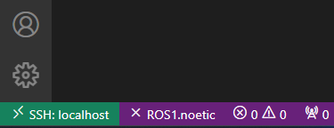

# Remote development

Most probably you will need to develop your applications on the Ubuntu container. But it may be time consuming and not very productive to install and configure it inside of the container. 

One of the ways to avoid this is to connect to the container from your preffered IDE on your machine using SSH. This way you can view, edit and download files. You can also run commands in the container from your IDE.

We will use Visual Studio Code as an example. You can use any other IDE that supports SSH.

## Using Remote SSH in Visual Studio Code

We refer ещ the original documentation. Please, visit [Remote Development in Visual Studio Code](https://code.visualstudio.com/docs/remote/ssh) for more details.

### Prerequisites

We assume that you have already installed Visual Studio Code and Started the container. SSH server is already installed in the container. 

Make sure that your machine OpenSSH clinet is installed on your machine. For the guide look
[Installing a supported SSH client](https://code.visualstudio.com/docs/remote/troubleshooting#_installing-a-supported-ssh-client)

Install the [Remote Development extension pack](https://marketplace.visualstudio.com/items?itemName=ms-vscode-remote.vscode-remote-extensionpack) in Visual Studio Code.

### Connect to the container

To connect to a remote host for the first time, follow these steps:

 - Verify you can connect to the SSH host by running the following command from a terminal / PowerShell:
    -  
    ```bash
    ssh abc@localhost -p 2222 
    ```
    > Note: The default host is `localhost` and the default port is `2222`. You can use different host and port if you are running the container on oher machine or port
- Open the Command Palette (Ctrl+Shift+P) and run the `Remote-SSH: Connect to Host` command.
- Select `Add New SSH Host` in the quick pick. Then type the SSH command you just ran in the terminal / PowerShell. Possibly you will need to select the SSH configuration file.
- Then select `Linux` as the operating system.
- You should now be asked to enter the password for the SSH host. Enter the password and you should be connected. 
- If you have done everything correctly, at the bottom left corner you should see:


### Open a folder in the container

- Open the sidebar and click on the `Open Folder` button:


- Select the folder you want to open in the container. Now all the files in the folder are available in the Visual Studio Code. You can edit them, download them, etc. You can also execute remote commands in IDE's terminal.